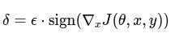

# Machine Learning Security Project
This project is developed for the UNICA.IT University Machine Learning Security exam. 

> **Master's degree in Computer Engineering, Cybersecurity and Artificial Intelligence - University of Cagliari**

> **Machine Learning Security - Supervisor: Prof. Battista Biggio**

> **Author**: Lello Molinario: 70/90/00369


***
# Table of Contents
1. [Installation](#installation)
2. [Project Goal](#project-goal)
4. [Solution Design](#solution-design)
5. [Conclusions](#conclusions)


***
## Installation
### Before running it, make sure you have Python 3.10 installed for compatibility between all libraries.

- Download the ZIP code or clone the repository inside Raspberry PI 3 B+ with
  ```bash
  git clone https://github.com/lmolinario/ML_Sec_project.git
  ```
- Install the requirements with

  ```bash
  python3.10 -m pip install git+https://github.com/RobustBench/robustbench.git

  git clone https://github.com/alirezaabdollahpour/SuperDeepFool.git SuperDeepFool


- Modificare il file requirements.txt per ignorare le versioni specifiche non compatibili
  ```bash
  sed -i '/numpy==1.19.0/d' SuperDeepFool/requirements.txt
  sed -i '/matplotlib==3.4.2/d' SuperDeepFool/requirements.txt
  sed -i '/numpy==1.19.0/d' SuperDeepFool/requirements.txt
  
-Installare il resto delle dipendenze
  ```bash
  pip3 install -r SuperDeepFool/requirements.txt

-Installare il resto delle dipendenze
  ```bash
  pip3 install -r requirements.txt
  
- Make sure you have the following libraries installed:

  ```bash
  pip3 install git+https://github.com/pralab/secml
  pip3 install git+https://github.com/RobustBench/robustbench.git
  ```
- Run the file `entrypoint.py` to start the program 


## Project goal
The goal of this project is to re-evaluate 5 RobustBench models using another attack algorithm (e.g., FMN) and identify samples for which one attack succeeds while the other fails. In other words, we aim to compare the effectiveness of different attacks against robust models, to analyze in which cases one type of attack is effective while another fails, thus contributing to a deeper understanding of the robustness of models and attack algorithms.

rivalutare i modelli qui intende considerare come baseline i risultati di autoattack - robustbench
e confrontarli con quello di un altro attacco
va bene SDF o FMN, o anche se vuole tutti e 2
il punto però è che dovrebbe usare la Robust Accuracy calcolata sullo stesso epsilon di autoattack (normalmente 8/255 se usa L-inf)
quindi in pratica se usa un min-distance come SDF o FMN, deve contare quanti sample bucano con distanza < 8/255
e per SDF va verificato che i pixel pure siano in [0,1] alla fine
mi pare che fosse pure buggato il codice

tutto chiaro?
B.


## Solution Design
#### Attack algorithm
As indicated in our project I took as a reference the FMN attack, also known as FGSM (Fast Gradient Sign Method), which is one of the most common attacks against neural networks.
The basic idea of ​​this attack is to calculate the gradient of the model with respect to the input image and add a perturbation in the direction of the gradient to maximize the loss. This type of attack can be implemented as follows:

 

Where:

δ is the generated perturbation.

ϵ is the magnitude of the perturbation (i.e. the strength of the attack).

∇xJ(θ,x,y) is the gradient of the loss function J with respect to the input image x, calculated for the model parameters θ.

sign(⋅) refers to the function that takes the sign of each gradient value.

The norm is a fundamental concept in all adversarial attacks.
It defines how to measure and bound the size of the perturbation added to the original image. It is a mathematical measure that establishes the "strength" of the perturbation and is used to control how much the original image is modified.

In our case of FMN attack, the norm directly influences the creation of the adversarial perturbation and its control.
Depending on the type of norm chosen, the perturbation can have different characteristics:

L2 norm (Euclidean): measures the Euclidean distance between the original and perturbed images. The L2 norm is generally sensitive to large changes in the images, but may not capture very small local perturbations that affect recognition.

L∞ norm (maximum norm): measures the maximum difference for each pixel between the original and perturbed images. The L∞ norm is useful for testing robustness against attacks that limit the perturbation to the maximum value for each pixel.

L1 norm: measures the absolute sum of the pixel-by-pixel differences. It is less sensitive than the L2 norm to large perturbations, but can be effective for detecting small uniformly distributed changes.

Lp norm (where p is a value between 1 and ∞): It is a generalization of the L1, L2 and L∞ norms.

For our project, we will use and compare "L2" and "L∞".


La distanza \( L^\infty \) è una misura fondamentale nei problemi di attacchi avversari, poiché rappresenta il massimo cambiamento che viene applicato a un singolo pixel nell'immagine durante la generazione di campioni avversari. Limitare la distanza \( L^\infty \) a un valore come \( 8/255 \) ha diverse motivazioni e importanza:

---

### 1. **Realismo del campione avversario**
   - **Motivazione**: Gli attacchi avversari devono essere visivamente impercettibili per un osservatore umano. Se la perturbazione supera un certo limite, il campione avversario potrebbe apparire distorto o artificiale.
   - **Spiegazione**: Un'alterazione minore (ad esempio \( \epsilon = 8/255 \)) garantisce che i cambiamenti nei pixel siano minimi, mantenendo l'immagine visivamente simile all'originale.

---

### 2. **Contesto applicativo: CIFAR-10**
   - CIFAR-10 utilizza immagini normalizzate con valori dei pixel compresi tra 0 e 1.
   - Un valore di \( 8/255 \) rappresenta una variazione molto piccola (circa il 3% della scala completa), il che è coerente con l'idea di una perturbazione "subdola" che sfrutta la vulnerabilità del modello senza modificare eccessivamente l'immagine.

---

### 3. **Standard nella comunità di ricerca**
   - **Motivazione**: La scelta di \( 8/255 \) non è arbitraria; è un valore standardizzato in molti studi sugli attacchi avversari, soprattutto per modelli testati su CIFAR-10 con la norma \( L^\infty \).
   - **Vantaggio**: Permette il confronto diretto tra risultati di attacchi avversari e difese, poiché molti benchmark utilizzano lo stesso limite.

---

### 4. **Robustezza del modello**
   - Limitare \( L^\infty \) a \( 8/255 \) aiuta a valutare quanto un modello sia robusto contro piccoli cambiamenti nei dati di input.
   - Un modello robusto dovrebbe essere in grado di mantenere prestazioni elevate anche con perturbazioni che rispettano questo limite.

---

### 5. **Efficienza computazionale**
   - Generare campioni avversari con vincoli di \( L^\infty \) più piccoli richiede una minore esplorazione dello spazio delle perturbazioni, rendendo gli attacchi più efficienti da calcolare.

---

### 6. **Controllo sulla generalizzabilità degli attacchi**
   - **Motivazione**: Limiti di \( L^\infty \) garantiscono che i risultati degli attacchi avversari siano affidabili e replicabili.
   - **Spiegazione**: Perturbazioni maggiori potrebbero attivare artefatti specifici del modello o del dataset, compromettendo la generalizzabilità dei risultati.

---

### Conclusione
Limitare la distanza \( L^\infty \) a \( 8/255 \) è essenziale per:
1. Garantire la **qualità e il realismo visivo** dei campioni avversari.
2. Permettere un **confronto equo** con altri metodi nella comunità di ricerca.
3. Valutare la **robustezza del modello** in modo standardizzato.
4. Evitare che il campione avversario diventi irrealistico o poco utile per analisi pratiche.

Se hai altre domande o vuoi approfondire, fammi sapere! 😊
#### Modularity: 
The project is structured in a modular way to allow the replacement of attack models and algorithms without having to redo the entire flow.

To do this I used to divide the code into "functions", "classes" and I used "pattern designs".

#### Scalability: 
The system will be scalable to be able to add more RobustBench models or try different attack algorithms in the future.


## Conclusions

