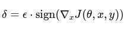
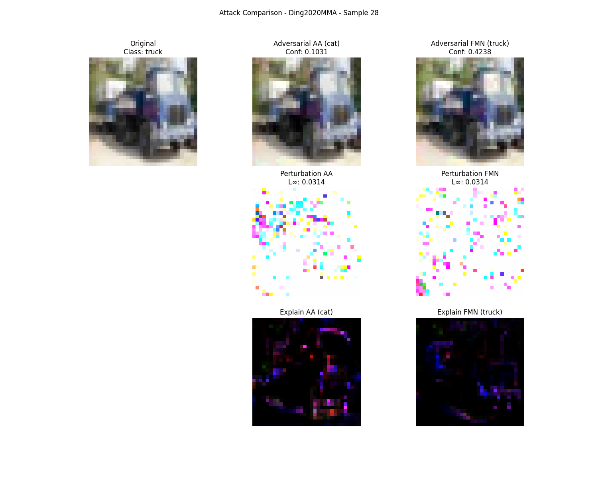
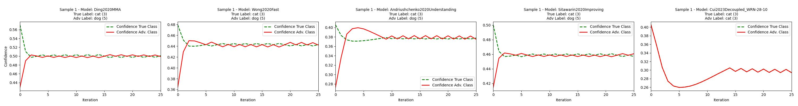
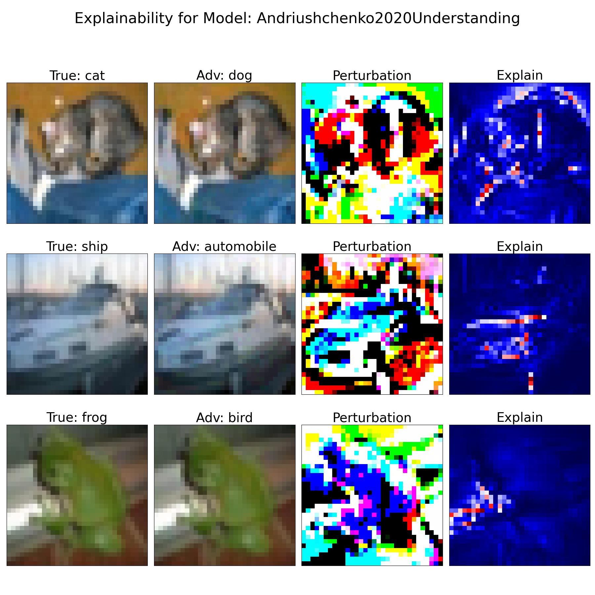

# Machine Learning Security -  Project #1 
This project is developed for the UNICA.IT University - Machine Learning Security exam. 

> **Master's degree in Computer Engineering, Cybersecurity and Artificial Intelligence - University of Cagliari**

> **Machine Learning Security - Supervisor: Prof. Battista Biggio**

> **Author**: Lello Molinario: 70/90/00369


***
# Table of Contents
1. [Installation](#installation)
2. [Project Goal](#project-goal)
4. [Solution Design](#solution-design)
5. [Conclusions](#conclusions)


***
## **Installation** 

### On your local machine
#### Before running it, make sure you have Python 3.10 installed for compatibility between all libraries.

- Download the ZIP code or clone the repository with
  ```bash
  git clone https://github.com/lmolinario/ML_Sec_project.git
  ```
- Enter inside a repository directory and install the requirements with

  ```bash
  pip3 install -r requirements.txt
  ```
- Run the file `entrypoint.py` to start the program 
 
  ```bash
  python3.10 entrypoint.py
  ```
### Directly on Colab
- click on the file `pyenv310_COLAB.ipynb`, directly from the code of this repository and then click on 
- or directly on this link
	https://colab.research.google.com/github/lmolinario/ML_Sec_project/blob/main/pyenv310_COLAB.ipynb
	and then run the notebook

## **Project Goal**
This project aims to reevaluate five RobustBench models using another attack algorithm (e.g., FMN) and identify samples for which one attack succeeds while the other fails. In other words, we aim to compare the effectiveness of different attacks against robust models and analyze which cases one type of attack is effective while another fails, thus contributing to a deeper understanding of the robustness of models and attack algorithms.

## **Solution Design**
To re-evaluate the FNM model, we use as a basis for comparison the results of "AutoAttack - Robustbench"
calculated on the same epsilon (in this case epsilon = 8/255 with "L-inf" norm) and we take into account the samples that successfully perturb the image with epsilon < 8/255.

### **Attack algorithm**
As indicated in our project I took as a reference the **FMN attack**, also known as FGSM (Fast Gradient Sign Method), which is one of the most common attacks against neural networks.
The basic idea of this attack is to calculate the model's gradient concerning the input image and add a perturbation in the direction of the gradient to maximize the loss. This type of attack can be implemented as follows:



Where:

**δ** is the generated perturbation.

**ϵ** is the magnitude of the perturbation (i.e. the strength of the attack).

**∇xJ(θ,x,y)** is the gradient of the loss function J concerning the input image x, calculated for the model parameters θ.

**sign(⋅)** refers to the function that takes the sign of each gradient value.

The **norm** is a fundamental concept in all adversarial attacks.
It defines how to measure and bound the size of the perturbation added to the original image. It is a mathematical measure that establishes the "strength" of the perturbation and is used to control how much the original image is modified.

In our case of **FMN attack**, the norm directly influences the creation of the adversarial perturbation and its control.
Depending on the type of norm chosen, the perturbation can have different characteristics:

**L∞ norm (maximum norm)**: measures the maximum difference for each pixel between the original and perturbed images. The L∞ norm is useful for testing robustness against attacks that limit the perturbation to the maximum value for each pixel.

**L2 norm (Euclidean)**: measures the Euclidean distance between the original and perturbed images. The L2 norm is generally sensitive to large changes in the images, but may not capture very small local perturbations that affect recognition.

**L1 norm**: measures the absolute sum of the pixel-by-pixel differences. It is less sensitive than the L2 norm to large perturbations but can be effective for detecting small uniformly distributed changes.

**Lp norm** (where p is a value between 1 and ∞): It is a generalization of the L1, L2 and L∞ norms.

**For our project, we will use and compare in attacks "L∞" norm.**

The distance "L∞" is a fundamental measure in adversarial attack problems, as it represents the maximum change that is applied to a single pixel in the image during the generation of adversarial samples.
Limiting the distance "L∞" to a specific epsilon value ( in our case 8/255 ) has several motivations and importance:
Adversarial attacks must be visually imperceptible to a human observer. If the perturbation exceeds a certain limit, the adversarial sample may appear distorted or artificial.
A smaller perturbation (epsilon < 8/255 ) ensures that the changes in pixels are minimal, keeping the image visually similar to the original.

Additionally, the CIFAR-10 dataset uses normalized images with pixel values between 0 and 1.
A value of epsilon = 8/255 represents a very small change (about 3% of the full scale), which is consistent with the idea of ​​a “sneaky” perturbation that exploits the model’s vulnerability without excessively changing the image.
The choice of epsilon = 8/255 is not arbitrary: it is a standardized value in many adversarial attack studies, especially for models tested on CIFAR-10 with the “L∞” norm.
It allows direct comparison of adversarial and defense results since many benchmarks use the same bound.

Generating adversarial samples with smaller “L∞” constraints requires less exploration of the perturbation space, making the attacks more efficient to compute.
Larger perturbations may trigger model- or dataset-specific artefacts, compromising the generalizability of the results.

### **Modularity** 
The project is structured in a modular way to allow the replacement of attack models and algorithms without having to redo the entire flow.

To do this I divided the code into "functions", and "classes" and used the "Strategy Design Pattern" for the attack class.

### **Scalability**
The system will be scalable to be able to add more RobustBench models or try different attack algorithms in the future.

## **Conclusions**
After analyzing the results of the two adversarial attacks (FMN and AutoAttack) on five RobustBench models, the following considerations can be made:

FMN is designed to find the minimum perturbation needed to alter the classification. If the required perturbation exceeds the available budget (ε = 8/255), the attack can fail, leaving the prediction unchanged.

AutoAttack combines multiple attacks (PGD, APGD, Square Attack, FAB), increasing the probability of finding an effective perturbation.
This makes it a more robust attack than FMN, which instead focuses on perturbation minimization.

Model robustness plays a key role
Some models may be more resistant to minimal perturbations (FMN) but vulnerable to more aggressive perturbations (AutoAttack).
Other models, however, may be equally vulnerable to both attacks.

### **Comparison with Known Benchmarks**

| **Models**                      | **Clean Accuracy** | **Accuracy under AutoAttack** | **Accuracy under FMN** |
|---------------------------------|--------------------|-------------------------------|------------------------|
| Ding2020MMA                     | ~84%               | 31.25%                        | 39.06%                 |
| Wong2020Fast                    | ~84%               | 37.50%                        | 42.19%                 |
| Andriushchenko2020Understanding | ~78%               | 43.75%                        | 43.75%                 |
| Sitawarin2020Improving          | ~82%               | 39.06%                        | 39.06%                 |
| Cui2023Decoupled_WRN-28-10      | ~93%               | 67.19%                        | 67.19%                 |


### **Interpretation of Results**
We identified **discordant samples**, i.e. those for which **FMN and AutoAttack had different results**:

### **Ding2020MMA**
- **5 discordant samples (27, 28, 31, 43, 57)**
- **AutoAttack is more effective** in samples: `27, 31, 43, 57`
- **FMN is more effective** in sample: `28`
- **Motivation:**
	- AutoAttack is more effective in most cases because it finds **a more aggressive direction in the perturbation**.
	- FMN manages to outperform it in sample `28`, probably because it **minimizes the perturbation better**, although it fails.

### **Wong2020Fast**
- **3 discordant samples (5, 16, 46)**
- **AutoAttack is more effective in all cases**
- **Rate:**
	- For this model, AutoAttack generated more effective perturbations than FMN, which may indicate that Wong2020Fast is **more resistant to small perturbations** (like FMN), but more vulnerable to more aggressive perturbations (like AutoAttack).

### **Andriushchenko2020Understanding**, **Sitawarin2020Improving**, **Cui2023Decoupled_WRN-28-10**
- **No discordant samples**
- **Rate:**
	- FMN and AutoAttack likely had the same effect on all samples, indicating that the model is **equally vulnerable** to both types of attacks.

### **Sample 28 Analysis**

**Sample 28** showed an interesting behavior when comparing **AutoAttack (AA)** to **Fast Minimum-Norm (FMN)**.




AutoAttack was successful in changing the class, in fact after the attack, the model classified the image as `'cat'` instead of `'truck'`.

FMN failed to change the class, which indicates that the perturbation found by FMN was not sufficient to force a class change: FMN is designed to find the minimum possible perturbation, so it may have failed to pass the model's decision threshold.

FMN generated a more confident prediction than AutoAttack, in fact the model's confidence after FMN is `0.4238`, significantly higher than the confidence after AutoAttack (`0.1031`). This suggests that **FMN did not significantly alter the distribution of pixel values**, 
leaving the model more confident in its decision. **AutoAttack, on the other hand, introduced a perturbation that confused the model, dramatically reducing its confidence in the prediction.**

One reason could be that FMN may have encountered a difficult decision barrier since it tries to minimize the perturbation, it may not have found an effective direction to change the prediction without exceeding the threshold of ε.

FMN maintained higher confidence in the original class, which suggests that the attack did not significantly alter the image.

These results are consistent with the nature of the attacks: FMN seeks the minimum perturbation, while AutoAttack is more aggressive and has a higher probability of success.


### **Comparison with the State of the Art**

The results obtained are in line with what reported in the literature on adversarial attacks:

AutoAttack is known to be one of the strongest and most reliable attacks, while FMN was developed to find minimal perturbations, often resulting less effective than more aggressive attacks.
More recent models (e.g. Cui2023Decoupled_WRN-28-10) show greater robustness, confirming the trends observed in RobustBench benchmarks.
The differences in sensitivity between models are consistent with previous studies, where it was observed that some models can be more vulnerable to sparse perturbations (Square Attack) than to minimal perturbations (FMN).

Finally, it is necessary to highlight that to evaluate an adversarial attack, **both confidence and perturbation** must be considered, depending on the aspect that you want to analyze.

**Model confidence** indicates how confident the model is in its prediction, so it is useful to evaluate the effectiveness of an attack in terms of:
1. **Model evasion**: if an attack manages to reduce the confidence of the correct class or increase that of the wrong class.
2. **Model stability**: if the model maintains high confidence even on perturbed samples, it could be more robust.
3. **Attack difficulty**: if the confidence remains high despite the perturbation, it means that the model is more difficult to attack.

**Perturbation** measures how much the original sample has been modified to generate the adversarial image. It is useful to evaluate:
1. **Attack efficiency**: an attack that induces error with a smaller perturbation is more effective.
2. **Attack perceptibility** : if the perturbation is visible to the human eye, the attack may be less stealthy.
3. **Model robustness** : if the model withstands large perturbations without changing output, it is more robust.

A global analysis approach of both factors is desirable: compare the confidence reduction and the amount of perturbation to see **which attack is more effective with the smallest possible perturbation**.

**Perturbation and Confidence plot**


